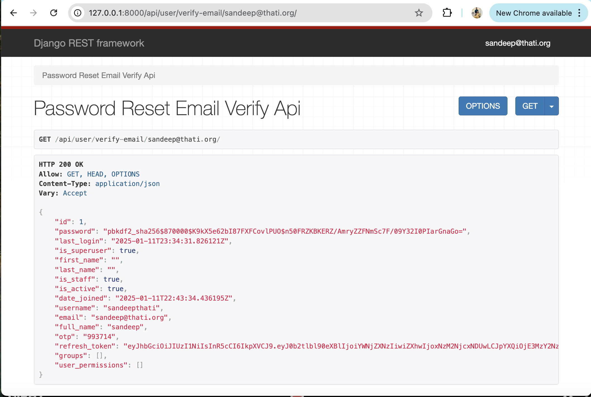
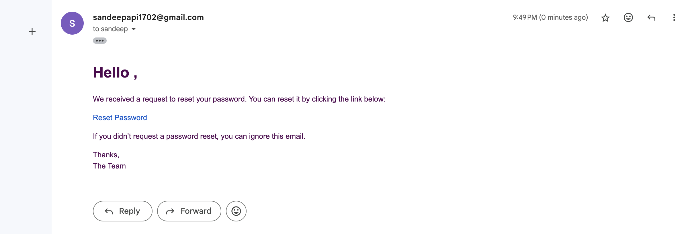
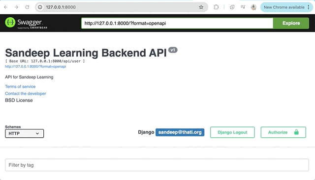
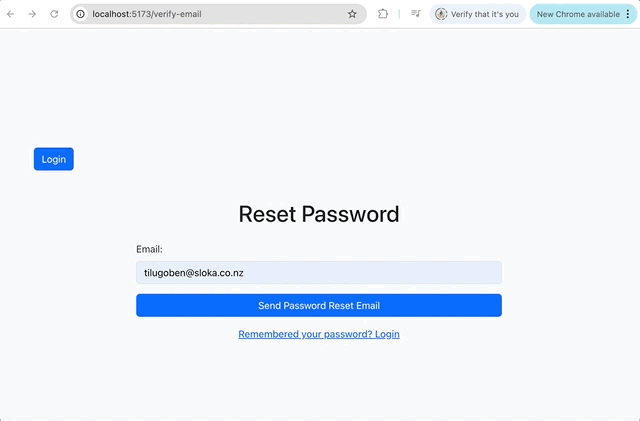

# learning-management-platform-React-Django
Online training and Certification Platform using Python, Django, Mysql, React. 

## Django setup

1) Create two folders named `backend` and `frontend`.
2) cd to folder backend 
3) Create virtual environment using the command `python3 -m venv venv`
4) Activate the virtual environment using command `source venv/bin/activate`
5) Install Django using the command `python3 -m pip install Django`
6) To check what apps are installed use command `pip freeze`
7) Create Django project `django-admin startproject backend` // "backend ." will remove aditional folder.
8) Install required packages. Create new txt file and name it requirements.txt and run `pip install -r requirements.txt`
9) Install app core using command `python3 manage.py startapp core`.
10) Install app userauths using command `python3 manage.py startapp userauths`
11) Install app api using command `python3 manage.py startapp api`
12) Create file called .gitignore and add files which you want to ignore.
13) Add custom apps to `settings.py` 
    ```Python
    # Application definition

    INSTALLED_APPS = [
        'jazzmin',
        'django.contrib.admin',
        'django.contrib.auth',
        'django.contrib.contenttypes',
        'django.contrib.sessions',
        'django.contrib.messages',
        'django.contrib.staticfiles',
        
        # Third party apps
        'core',
        'userauths',
        'api',
    ]

    ```Python
14) Run the server using command `python3 manage.py runserver`
15) Apply all migrations using command `python3 manage.py migrate`
16) Create superuser for admin using command `python3 manage.py createsuperuser`
17) Install jazzmin which will enhance features of admin panal.
    


## Customize Jazzmin UI
18) Add below code in settings.py

    refere to below doc for further customization.
    `[Jazzmin documentation](https://django-jazzmin.readthedocs.io/configuration/)`
    ```Python
    JAZZMIN_SETTINGS = {
    # title of the window (Will default to current_admin_site.site_title if absent or None)
    "site_title": "Sandeep Learning Admin",
    "site_header": "Sandeep Learning Admin",
    "site_brand": "Sandeep Learning Admin",
    "welcome_sign": "Welcome to the Sandeep Learning Admin",
    "copyright": "Sloka IT Services Ltd",
    "show_ui_builder": True,

    }
    ```
## Static files
19) Go to `settings.py` and write below code.
    ```Python
    from pathlib import Path
    import os

    TEMPLATES = [
        {
            'BACKEND': 'django.template.backends.django.DjangoTemplates',
            'DIRS': [os.path.join(BASE_DIR, "templates")],
            'APP_DIRS': True,
            'OPTIONS': {
                'context_processors': [
                    'django.template.context_processors.debug',
                    'django.template.context_processors.request',
                    'django.contrib.auth.context_processors.auth',
                    'django.contrib.messages.context_processors.messages',
                ],
            },
        },
    ]


    STATIC_URL = 'static/'
    STATICFILES_DIRS = [
        os.path.join(BASE_DIR, "static"),
    ]
    STATIC_ROOT = os.path.join(BASE_DIR, 'templates')
    media_url = '/media/'
    MEDIA_ROOT = os.path.join(BASE_DIR, 'media')

    ```

## Import URLs
20) Go to `urls.py` and add below code

    ```Python
    from django.conf import settings
    from django.conf.urls.static import static
    ```
21) Also in urls.py add url path to static files
    ```Python
    urlpatterns = [
        path('admin/', admin.site.urls),
    ]
    urlpatterns += static(settings.MEDIA_URL, document_root=settings.MEDIA_ROOT)
    urlpatterns += static(settings.STATIC_URL, document_root=settings.STATIC_ROOT)
    ```
## Creating custom users and models.
22) Go to userauths folder and open file models.py to update below code
    ```Python
    from django.db import models
    from django.contrib.auth.models import AbstractUser

    # Create your models here.

    class User(AbstractUser):
        username = models.CharField(max_length=255, unique=True)
        email = models.EmailField(max_length=255, unique=True)
        full_name = models.CharField(max_length=255, blank=True, null=True)
        otp = models.CharField(max_length=6, unique=True)

        USERNAME_FIELD = 'email'
        REQUIRED_FIELDS = ['username']

        def __str__(self):
            return self.email
        
        def save(self, *args, **kwargs):
            email_username, full_name = self.email.split('@')
            if self.full_name == "" or self.full_name == None:
                self.full_name = email_username
            if self.username == "" or self.username == None:
                self.username = email_username
            super(User, self).save(*args, **kwargs)


    class Profile(models.Model):
        user = models.OneToOneField(User, on_delete=models.CASCADE)
        image = models.FileField(upload_to='profile_pics/', default = "default-profile.png", blank=True, null=True)
        bio = models.TextField(blank=True, null=True)
        full_name = models.CharField(max_length=255, blank=True, null=True)
        country = models.CharField(max_length=255, blank=True, null=True)
        created_at = models.DateTimeField(auto_now_add=True)
        updated_at = models.DateTimeField(auto_now=True)

        def __str__(self):
            if self.full_name:
                return str(self.full_name)
            else:
                return str(self.user.full_name)

        def save(self, *args, **kwargs):
            if self.profile_pic == "":
                self.profile_pic = "profile_pics/default.png"
            if self.full_name == "" or self.full_name == None:
                self.full_name = self.user.username
            super(Profile, self).save(*args, **kwargs)


    ```
23) In userauths folder open admin.py file to update below code
    ```Python
    from django.contrib import admin
    from .models import User, Profile

    # Register your models here.

    class ProfileAdmin(admin.ModelAdmin):
        list_display = ['user', 'full_name', 'country', 'created_at', 'updated_at']
        search_fields = ['user__email', 'user__username', 'full_name', 'country']
        list_filter = ['created_at', 'updated_at']


    admin.site.register(User)
    admin.site.register(Profile, ProfileAdmin)
    ```
24) Output so far.
    

25) Automatically create Profile when User is created.
    To do that go to folder userauths and open file models.py to write below code.
    ```Python
    from django.db.models.signals import post_save

    # End of models.py write below code.

    def create_profile(sender, instance, created, **kwargs):
    if created:
        Profile.objects.create(user=instance)   

    def save_profile(sender, instance, **kwargs):
        instance.profile.save()

    post_save.connect(create_profile, sender=User)
    post_save.connect(save_profile, sender=User)
    ```

26) ## Testing.
    Create a new user and confirm profile is created automatically. Also delete user and confirm profile is deleted.
    

27) ## Serialization
    Create a new file under api folder and name it serializer.py and copy below code

    ```Python
    from rest_framework import serializers
    from userauths.models import User, Profile

    class UserSerializer(serializers.ModelSerializer):
        class Meta:
            model = User
            fields = '__all__'

    class ProfileSerializer(serializers.ModelSerializer):
        class Meta:
            model = Profile
            fields = '__all__'

    ```

28) Install/Register 3rd party apps in settings.py
    Install rest_framework and corsheaders
    ```python
    # Application definition

    INSTALLED_APPS = [
        'rest_framework',
        'rest_framework_simplejwt.token_blacklist',
        'corsheaders',

    ]

    MIDDLEWARE = [
        'corsheaders.middleware.CorsMiddleware',
        'django.middleware.security.SecurityMiddleware',
    ]

    ```

29) ## JWT Settings
    Code below is static and one off code written in settings.py
    ```Python
        SIMPLE_JWT = {
        'ACCESS_TOKEN_LIFETIME': timedelta(minutes=15),
        'REFRESH_TOKEN_LIFETIME': timedelta(days=1),
        'ROTATE_REFRESH_TOKENS': True,
        'BLACKLIST_AFTER_ROTATION': True,
        'UPDATE_LAST_LOGIN': False,
        'ALGORITHM': 'HS256',
        'verifing_key': None,
        'AUDIENCE': None,
        'ISSUER': None,
        'jwk_url': None,
        'LEEWAY': 0,
        'AUTH_HEADER_TYPES': ('Bearer',),
        'AUTH_HEADER_NAME': 'HTTP_AUTHORIZATION',
        'USER_ID_FIELD': 'id',
        'USER_ID_CLAIM': 'user_id',
        'USER_AUTHENTICATION_RULE': 'rest_framework_simplejwt.authentication.default_user_authentication_rule',
        'AUTH_TOKEN_CLASSES': ('rest_framework_simplejwt.tokens.AccessToken',),
        'TOKEN_TYPE_CLAIM': 'token_type',
        'TOKEN_USER_CLASS': 'rest_framework_simplejwt.models.TokenUser',
        'JTI_CLAIM': 'jti',
        'SLIDING_TOKEN_REFRESH_EXP_CLAIM': 'refresh_exp',
        'SLIDING_TOKEN_LIFETIME': timedelta(minutes=5),
        'SLIDING_TOKEN_REFRESH_LIFETIME': timedelta(days=1),
    }
    ```
30) Cornheaders in settings.py
    ```Python
    CORS_ALLOW_ALL_ORIGINS = True

    CORS_ALLOWED_ORIGINS = [
        "http://localhost:3000",
        "http://localhost:8000",
        "http://localhost:8080",

    ]
    ```

31) ## Token Serialization
    add below code to serializer.py file.
    ```Python
    from rest_framework_simplejwt.serializers import TokenObtainPairSerializer


    class MyTokenObtainPairSerializer(TokenObtainPairSerializer):
        @classmethod
        def get_token(cls, user):
            token = super(MyTokenObtainPairSerializer, cls).get_token(user)
            token['email'] = user.email
            token['username'] = user.username
            if hasattr(user, 'profile'):
                token['full_name'] = user.profile.full_name
            return token
    ```

32) Serializer class in api views
    Open views.py in API folder and write below code
    ```Python
    from django.shortcuts import render
    from api import serializer as api_serializer
    from rest_framework_simplejwt.views import TokenObtainPairView

    class MyTokenObtainPairView(TokenObtainPairView):
        serializer_class = api_serializer.MyTokenObtainPairSerializer
    ```
33) Add urls in api
    Create a new file urls.py in API folder and write below code.
    ```Python
    from api import views as api_views
    from django.urls import path

    urlpatterns = [
        path("user/token/", api_views.MyTokenObtainPairView.as_view(), name="token_obtain_pair"),
    ]
    ```
34) Add urls in backend folder
    Open file urls.py in backend folder and write below code.
    ```Python
    from django.urls import path, include

    urlpatterns = [
        path('api/', include('api.urls')),
    ]
    ```
35) Token Output
    If we go to URL http://127.0.0.1:8000/api/user/token/ we can see the token and refresh token.
    

36) Register User
    Open serializer.py in api folder and write below code
    ```Python
    from django.contrib.auth.password_validation import validate_password

    class RegisterSerializer(serializers.ModelSerializer):
        password1 = serializers.CharField(write_only=True, required=True, validators=[validate_password])
        password2 = serializers.CharField(write_only=True, required=True)
        class Meta:
            model = User
            fields = ['full_name', 'email', 'password1', 'password2']

        def validate(self, attrs):
            if attrs['password1'] != attrs['password2']:
                raise serializers.ValidationError({"password": "Password fields didn't match"})
            return attrs
        
        def create(self, validated_data):
            email_username, _ = validated_data['email'].split('@')
            full_name = validated_data.get('full_name', email_username)

            user = User.objects.create_user(
                email=validated_data['email'],
                username = email_username,
                full_name = full_name,
                password = validated_data['password1']
            )
            user.save()
            return user
    ```

37) Register User views
    Open views.py file in api folder and write below code.
    ```Python
    from rest_framework import generics, permissions
    from userauths.models import User, Profile

    class RegisterView(generics.CreateAPIView):
        queryset = User.objects.all()
        serializer_class = api_serializer.RegisterSerializer
        permission_classes = (permissions.AllowAny,)
    ```
38) Register urls 
    Open urls.py in api folder and write below code.
    ```Python
    from rest_framework_simplejwt.views import TokenObtainPairView

    urlpatterns = [
        path("user/token/", api_views.MyTokenObtainPairView.as_view(), name="token_obtain_pair"),
        path("user/register/", api_views.RegisterView.as_view(), name="register"),
        path("user/token/refresh/", TokenObtainPairView.as_view(), name="token_refresh"),

    ]
    ```
39) Output for API Register
    
40) Output for Token Refresh
    

41) ## Password reset email verify API
    Open models.py in backend folder and write below code
    ```Python

    refresh_token = models.CharField(max_length=1000, blank=True, null=True)
    ```
42) Open views.py in API folder and write below code.
    ```Python
    from rest_framework_simplejwt.tokens import RefreshToken
    class PasswordResetEmailVerifyAPIView(generics.RetrieveAPIView):
    serializer_class = api_serializer.UserSerializer
    permission_classes = (permissions.AllowAny,)

    def get_object(self):
        email = self.kwargs.get('email')
        user = User.objects.filter(email=email).first()

        if user:
            user.otp = generate_otp()
            refresh = RefreshToken.for_user(user)
            refresh_token = str(refresh.access_token)
            user.refresh_token = refresh_token
            uuidb64 = user.pk
            user.save()

            reset_link = f"http://l127.0.0.1:8000/reset-password/?otp={user.otp}&uuidb64={uuidb64}&refresh_token={refresh_token}"

            print(reset_link)
        
        return user
    ```
43) Register url 
    Open urls.py in api folder and write below code
    ```Python
    urlpatterns = [
        path("user/verify-email/<str:email>/", api_views.PasswordResetEmailVerifyAPIView.as_view(), name="verify_email"),
    ]
    ```

44) ## Reset Password
    Open views.py in api folder and write below code
    ```Python
    from rest_framework import generics, permissions, status

    class ResetPasswordAPIView(generics.CreateAPIView):
    serializer_class = api_serializer.UserSerializer
    permission_classes = (permissions.AllowAny,)

    def create(self, request, *args, **kwargs):
        payload = request.data

        otp = payload.get('otp')
        uuidb64 = payload.get('uuidb64')
        password = payload.get('password')
        refresh_token = payload.get('refresh_token')

        user = User.objects.filter(pk=uuidb64, otp = otp).first()
        if user:
            user.set_password(password)
            user.otp = None
            user.refresh_token = None
            user.save()
            return Response({'message': 'Password Reset Success'}, status=status.HTTP_200_OK)
        else:
            return Response({'message': 'Something went wrong!'}, status=status.HTTP_400_BAD_REQUEST)
            
        
    ```

45) Register url 
    Open urls.py in api folder and write below code
    ```Python
    urlpatterns = [
        path("user/reset-password/", api_views.ResetPasswordAPIView.as_view(), name="reset_password"),
    ]
    ```

46) ## Environment variables
    Open settings.py and initialize variables.
    ```Python
    from environs import Env
    env = Env()
    BASE_DIR = Path(__file__).resolve().parent.parent
    env.read_env(os.path.join(BASE_DIR, '..', 'venv', '.env'))

    env.read_env()

    ```
47) Create a new file .env in folder venv and create your first variable.
    ```Python
    MAILGUN_SECREAT_KEY=yoursecreatkey
    ```
    In settings.py
    ```Python
    GMAIL_HOST="youremailaddress"
    GMAIL_PASSWORD="youremailpassword"
    ```
48) ## Email System
    Open settings.py and add below code
    ```Python
    # settings.py

    EMAIL_BACKEND = 'django.core.mail.backends.smtp.EmailBackend'
    EMAIL_HOST = 'smtp.gmail.com'  # For Gmail
    EMAIL_PORT = 587
    EMAIL_USE_TLS = True
    EMAIL_HOST_USER = env("GMAIL_HOST")  # Replace with your email
    EMAIL_HOST_PASSWORD = env("GMAIL_PASSWORD") # Replace with your app-specific password


    ```
49) ### Email template folders
    create folder email inside backend/templates
    create file password_reset.html inside folder email
    write below code inside password_reset.html
    ```HTML
    <!DOCTYPE html>
    <html>
    <head>
        <title>Password Reset</title>
    </head>
    <body>
        <h1>Hello {{ username }},</h1>
        <p>We received a request to reset your password. You can reset it by clicking the link below:</p>
        <p><a href="{{ reset_link }}">Reset Password</a></p>
        <p>If you didn’t request a password reset, you can ignore this email.</p>
        <p>Thanks,<br>The Team</p>
    </body>
    </html>

    ```

50) Open views.py from api folder and write below code
    ```Python
    def send_simple_email(user, reset_link):
        subject = f"Hello {user.username}! Reset your password"
        from_email = settings.EMAIL_HOST_USER  # Must match EMAIL_HOST_USER
        recipient_list = [user.email]

        params = {
            'user': user,
            'reset_link': reset_link
        }

        text_body = render_to_string("email/password_reset.html", params)
        
        send_mail(subject, "", from_email, recipient_list, html_message=text_body)


    ```
51) Generate reset link and send to function send_simple_email
    ```Python
    class PasswordResetEmailVerifyAPIView(generics.RetrieveAPIView):
        serializer_class = api_serializer.UserSerializer
        permission_classes = (permissions.AllowAny,)

        def get_object(self):
            email = self.kwargs.get('email')
            user = User.objects.filter(email=email).first()

            if not user:
                raise Response({'message': 'User with this email does not exist.'}, status=status.HTTP_404_NOT_FOUND)
        
            user.otp = generate_otp()
            refresh = RefreshToken.for_user(user)
            refresh_token = str(refresh.access_token)
            user.refresh_token = refresh_token
            # uuidb64 = user.pk
            uuidb64 = urlsafe_base64_encode(force_bytes(user.pk))
            user.save()

            reset_link = f"http://127.0.0.1:8000/reset-password/?otp={user.otp}&uuidb64={uuidb64}&refresh_token={refresh_token}"
            send_simple_email(user, reset_link)
            print(reset_link)
            
            return user
    ```

52) ### Output
    
    

53) ## drf_yasg 
    ```Python
    from rest_framework import permissions
    from drf_yasg.views import get_schema_view
    from drf_yasg import openapi

    schema_view = get_schema_view(
        openapi.Info(
            title="Sandeep Learning Backend API",
            default_version='v1',
            description="API for Sandeep Learning",
            terms_of_service="http://wwww.sloka.co.nz",
            contact=openapi.Contact(email="support@sloka.co.nz"),
            license=openapi.License(name="BSD License"),
        ),
        public=True,
        permission_classes=(permissions.AllowAny,),
    )

    urlpatterns = [
        path('swagger<format>/', schema_view.without_ui(cache_timeout=0), name='schema-json'),
        path("", schema_view.with_ui('swagger', cache_timeout=0), name='schema-swagger-ui'),
        path('redoc/', schema_view.with_ui('redoc', cache_timeout=0), name='schema-redoc'),

    ]

    ```
54) Register app 'drf_yasg' in settings.py

55) OUTPUT Swagger
    

56) # React Installation
    Open new terminal and goto folder frontend to install React
    ```bash
    # Install yarn
    npm install --global yarn

    yarn create vite frontend --template react

    cd frontend

    yarn

    yarn add axios

    # To start the dev server
    yarn dev
    ```

57) ## Install Packages
    Open package.json inside frontend folder and update with below packages.
    run `yarn` command once you pasted below packages.
    You can also install packages individually by using `yarn add packagename` command in bash

    ```Jsx
    {
    "name": "frontend",
    "private": true,
    "version": "0.0.0",
    "type": "module",
    "scripts": {
        "dev": "vite",
        "build": "vite build",
        "lint": "eslint .",
        "preview": "vite preview"
    },
    "dependencies": {
        "@ckeditor/ckeditor5-build-classic": "^44.1.0",
        "@ckeditor/ckeditor5-react": "^9.4.0",
        "@paypal/react-paypal-js": "^8.7.0",
        "axios": "^1.7.9",
        "bootstrap": "^5.3.3",
        "chart.js": "^4.4.7",
        "dayjs": "^1.11.13",
        "js-cookie": "^3.0.5",
        "moment": "^2.30.1",
        "react": "^19.0.0",
        "react-bootstrap": "^2.10.7",
        "react-chart": "^0.0.1",
        "react-chartjs-2": "^5.3.0",
        "react-dom": "^19.0.0",
        "react-hook-form": "^7.54.2",
        "react-icons": "^5.4.0",
        "react-photo-album": "^3.0.2",
        "react-player": "^2.16.0",
        "react-rater": "^6.0.5",
        "react-router-dom": "^7.1.1",
        "sweetalert2": "^11.15.10",
        "yet-another-react-lightbox": "^3.21.7",
        "zustand": "^5.0.3"
    },
    "devDependencies": {
        "@eslint/js": "^9.17.0",
        "@types/react": "^19.0.6",
        "@types/react-dom": "^19.0.3",
        "@vitejs/plugin-react": "^4.3.4",
        "eslint": "^9.17.0",
        "eslint-plugin-react": "^7.37.2",
        "eslint-plugin-react-hooks": "^5.0.0",
        "eslint-plugin-react-refresh": "^0.4.16",
        "globals": "^15.14.0",
        "prettier": "^3.4.2",
        "simple-zustand-devtools": "^1.1.0",
        "vite": "^6.0.5"
    }
    }
    
    ```
58) Upgrade all packages to latest using below code.
    ```bash
    yarn upgrade --latest
    ```

59) ## Zustand
    Create a new folder and name it as store under frontend/src.
    Create a new file and name it as auth.js under frontend/src/store.
    ```Jsx
    import {create} from 'zustand';
    import {mountStoreDevtool} from 'simple-zustand-devtools';

    export const useAuthStore = create((set, get) => ({
        alluserdata: null,
        loading: false,

        user: () => ({
            user_id: get().alluserdata?.user_id || null,
            username: get().alluserdata?.username || null,
        }),

        setUser: (user) => set({
            alluserdata: user,
        }),

        setLoading: (loading) => set({loading}),

        logout: () => set({
            alluserdata: null,
        }),

        isLoggedIn: () => get().alluserdata !== null,

    }));

    if (import.meta.env.MODE === 'development') {
        mountStoreDevtool('AuthStore', useAuthStore);
    }


    ```
60) # Axios
    Create a folder utils under scr
    create 4 files auth.js, axios.js, constants.js, useAxios.js in utils folder
    write below code in axios.js
    ```Jsx
    # axios.js
    import axios from 'axios';

    const apiInstance = axios.create({
        baseURL: 'http://localhost:8000/api/',
        timeout: 1000,
        headers: {
            'Content-Type': 'application/json',
            'Accept': 'application/json',
        },
    });

    export default apiInstance;
    ```
61) Open auth.js file in utils folder
    ```Jsx
    import {useAuthStore} from '../store/auth';
    import {axios} from './axios';
    import jwtDecode from 'jwt-decode';
    import cookie from 'js-cookie';
    import Swal from 'sweetalert2';

    export const login = async (email, password) => {
        try {
            const {data, status} = await axios.post('user/token/', {email, password});

            if (status === 200) {
                setAuthUser(data.access, data.refresh);
                alert('Login successful');
            }

            return {data, error: null};
        } catch (error) {
            console.error(error);
            Swal.fire({
                icon: 'error',
                title: 'Error',
                text: error.response.data?.detail || "Something went wrong",
            });
            return {data: null, error: error.response.data?.detail || "Something went wrong"};
        }
    };

    export const register = async (full_name, email, password1, password2) => {
        try {
            const {data, status} = await axios.post('user/register/', {full_name, email, password1, password2});

            if (status === 201) {
                await login(email, password1);
                alert('Registration successful');
            }

            return {data, error: null};
        } catch (error) {
            console.error(error);
            Swal.fire({
                icon: 'error',
                title: 'Error',
                text: error.response.data?.detail || "Something went wrong",
            });
            return {data: null, error: error.response.data?.detail || "Something went wrong"};
        }
    }


    export const logout = () => {
        Cookies.remove('access_token');
        Cookies.remove('refresh_token');
        useAuthStore.getState().setUser(null);
        alert('Logout successful');
    }

    export const setUser = async () => {
        const access_token = Cookies.get('access_token');
        const refresh_token = Cookies.get('refresh_token');

        if (!access_token || !refresh_token) {
            return;
        }

        if (isAccessTokenExpired(access_token)) {
            const {data, error} = await getRefreshAccessToken(refresh_token);
            if (error) {
                return;
            }
            setAuthUser(data.access, data.refresh);
        } else {
            setAuthUser(access_token, refresh_token);
        }
    }

    export const setAuthUser = (access_token, refresh_token) => {
        Cookies.set('access_token', access_token, {expires: 1, secure: true});
        Cookies.set('refresh_token', refresh_token, {expires: 1, secure: true});

        const user = jwtDecode(access_token) ?? null;

        if (user) {
            useAuthStore.getState().setUser(user);
        } else {
            useAuthStore.getState().setLoading(false);
        }
    }

    export const getRefreshAccessToken = async () => {
        try {
            const refresh_token = Cookies.get('refresh_token');
            const {data, status} = await axios.post('user/token/refresh/', {refresh: refresh_token});

            if (status === 200) {
                return {data, error: null};
            }
        } catch (error) {
            console.error(error);
            Swal.fire({
                icon: 'error',
                title: 'Error',
                text: error.response.data?.detail || "Something went wrong",
            });
            return {data: null, error: error.response.data?.detail || "Something went wrong"};
        }
    }

    export const isAccessTokenExpired = (access_token) => {
        try {
            const decodedtoken = jwtDecode(access_token);
            return decodedtoken.exp < Date.now() / 1000;
        } catch (error) {
            console.error('Invalid token:', error.message);
            throw new Error('Failed to decode token');
            return true;
        }
    };

    ```

62) Open useAxios.js and write below code.
    ```Jsx
    import axios  from "axios";
    import { API_URL } from "./constants";
    import { getRefreshAccessToken, isAccessTokenExpired, setAuthUser } from "./auth";
    import Cookies from "js-cookie";

    const useAxios = () => {
        const access_token = Cookies.get("access_token");
        const refresh_token = Cookies.get("refresh_token");

        const axiosInstance = axios.create({
            baseURL: API_URL,
            timeout: 1000,
            headers: {
                'Content-Type': 'application/json',
                'Accept': 'application/json',
                'Authorization': `Bearer ${access_token}`,
            },
        });

        axiosInstance.interceptors.request.use(async (config) => {
            if (!isAccessTokenExpired()) {
                return config;
            } else {
                const new_access_token = await getRefreshAccessToken(refresh_token);
                setAuthUser(new_access_token.access, new_access_token.refresh);
                config.headers['Authorization'] = `Bearer ${new_access_token.access}`;
                return config;
            }
            return axiosInstance;
        });

    };

    export default useAxios;


    ```

63) Create mainWrapper.js file in folder frontend/layouts/mainWrapper.js
    ```Jsx
    import { useState, useEffect } from 'react';
    import { setUser } from '../utils/auth';

    const MainWrapper = ({ children }) => {
        const [loading, setLoading] = useState(true); // Track loading state
        const [error, setError] = useState(null); // Track errors

        useEffect(() => {
            const handler = async () => {
                try {
                    await setUser(); // Execute the user setup
                    setLoading(false); // Mark loading as complete
                } catch (err) {
                    setError(err.message); // Capture any errors
                    setLoading(false); // Ensure loading state is cleared even on error
                }
            };
            handler();
        }, []);

        if (loading) {
            return <div>Loading...</div>; // Placeholder during loading
        }

        if (error) {
            return <div>Error: {error}</div>; // Display error if something goes wrong
        }

        return <>{children}</>; // Render children once ready
    };

    export default MainWrapper;


    ```

64) Route to login page 
    Create a new file privateRoute.js in folder frontend/src/layouts/privateRoute.js
    ```Jsx
    import { Navigate } from 'react-router-dom';
    import { useAuthStore } from '../store/auth';

    const PrivateRoute = ({ children }) => {
        const isLoggedIn = useAuthStore((state) => state.isLoggedIn());

        return isLoggedIn ? children : <Navigate to="/login" replace />;
    };

    export default PrivateRoute;

    ```

65) App.jsx in src folder.
    ```Jsx
    import { Route, Routes, BrowserRouter, useLocation } from 'react-router-dom'
    import './App.css'
    import MainWrapper from './layouts/mainWrapper'
    import PrivateRoute from './layouts/privateRoute'
    import Register from './views/auth/Register'
    import Login from './views/auth/Login'

    function App() {
    return  (
        <BrowserRouter>
        <MainWrapper>
            <MyLandingPage />
            <Routes>
            <Route path="/register" element={<Register />} />
            <Route path="/login" element={<Login />} />
            <Route path="/*" element={<PrivateRoute element={<MainWrapper />} />} />
            </Routes>
        </MainWrapper>
        </BrowserRouter>

    )  
    }

    const MyLandingPage = () => {
    const location = useLocation();
    return location.pathname === '/' ? <h1>Hello World !</h1> : null
    }

    export default App

    ```

66) # Register.jsx
    ```Jsx
    import { useState, useEffect } from "react";
    import { Link, useNavigate } from "react-router-dom";
    import apiInstance from "../../utils/axios";
    import { register } from "../../utils/auth";

    function Register() {
    const [fullName, setFullName] = useState("");
    const [email, setEmail] = useState("");
    const [password, setPassword] = useState("");
    const [passwordConfirmation, setPasswordConfirmation] = useState("");
    const [error, setError] = useState("");
    const [success, setSuccess] = useState(false);
    const [loading, setLoading] = useState(false);
    const navigate = useNavigate();
    console.log(fullName)

    useEffect(() => {
        // Reset error state when the component mounts
        setError("");
    }, []);

    const handleSubmit = async (event) => {
        event.preventDefault();
        setLoading(true);
        setError("");
        setSuccess(false);

        if (password !== passwordConfirmation) {
        setError("Passwords do not match");
        setLoading(false);
        return;
        }

        try {
        // const response = await apiInstance.post("/user/register/", {
        //   full_name: fullName,
        //   email,
        //   password1: password,
        //   password2: passwordConfirmation,
        // });
        const response = await register(fullName, email, password, passwordConfirmation);
        setSuccess("true");
        } catch (err) {
        setError(err.response.data?.detail || "Something went wrong");
        
        } finally {
        setLoading(false);
        }
    };

    return (
        <div className="container mt-5 ">
        <h1 className="text-center mb-4">Register</h1>
        {error && <div className="alert alert-danger">{error}</div>}
        {success && (
            <div className="alert alert-success">
            Registration successful!
            <div className="mt-3">
                <button className="btn btn-primary me-2" onClick={() => navigate('/')}>Home</button>
                <button className="btn btn-secondary" onClick={() => navigate('/login')}>Login</button>
            </div>
            </div>
        )}
        {!success && (
            <form onSubmit={handleSubmit} className="mx-auto" style={{ maxWidth: '600px' }}>
            <div className="mb-3">
            <label htmlFor="fullName" className="form-label">Full Name:</label>
            <input
                type="text"
                className="form-control"
                id="fullName"
                value={fullName}
                onChange={(e) => setFullName(e.target.value)}
                required
            />
            </div>
            <div className="mb-3">
            <label htmlFor="email" className="form-label">Email:</label>
            <input
                type="email"
                className="form-control"
                id="email"
                value={email}
                onChange={(e) => setEmail(e.target.value)}
                required
            />
            </div>
            <div className="mb-3">
            <label htmlFor="password" className="form-label">Password:</label>
            <input
                type="password"
                className="form-control"
                id="password"
                value={password}
                onChange={(e) => setPassword(e.target.value)}
                required
            />
            </div>
            <div className="mb-3">
            <label htmlFor="passwordConfirmation" className="form-label">Confirm Password:</label>
            <input
                type="password"
                className="form-control"
                id="passwordConfirmation"
                value={passwordConfirmation}
                onChange={(e) => setPasswordConfirmation(e.target.value)}
                required
            />
            </div>
            <button type="submit" className="btn btn-primary w-100" disabled={loading}>
            {loading ? "Registering..." : "Register"}
            </button>
        </form>
        )}
        <div className="text-center mt-3">
            <Link to="/login">Already have an account? Login</Link>
        </div>
        </div>
    );
    }

    export default Register;
    ```

67) # Login.jsx
    ```Jsx
    import { useState, useEffect } from "react";
    import { Link, useNavigate } from "react-router-dom";
    import apiInstance from "../../utils/axios";
    import { login } from "../../utils/auth";

    function Login() {
    const [email, setEmail] = useState("");
    const [password, setPassword] = useState("");
    const [error, setError] = useState("");
    const [loading, setLoading] = useState(false);
    const [success, setSuccess] = useState(false);
    const navigate = useNavigate();

    useEffect(() => {
        // Reset error state when the component mounts
        setError("");
    }, []);

    const handleSubmit = async (event) => {
        event.preventDefault();
        setLoading(true);
        setError("");

        try {
        const response = await login(email, password);
        console.log(response);
        setLoading(false);
        setSuccess(true);
        navigate("/"); // Redirect to dashboard or any other page after successful login
        } catch (err) {
        setLoading(false);
        setError(err.response.data?.detail || "Invalid email or password");
        
        } 
    };

    return (
        <div className="container mt-5">
        <h1 className="text-center mb-4">Login</h1>
        {error && <div className="alert alert-danger">{error}</div>}
        {success && <div className="alert alert-success">Login successful</div>}
        <form onSubmit={handleSubmit} className="mx-auto" style={{ maxWidth: '600px' }}>
            <div className="mb-3">
            <label htmlFor="email" className="form-label">Email:</label>
            <input
                type="email"
                className="form-control"
                id="email"
                value={email}
                onChange={(e) => setEmail(e.target.value)}
                required
            />
            </div>
            <div className="mb-3">
            <label htmlFor="password" className="form-label">Password:</label>
            <input
                type="password"
                className="form-control"
                id="password"
                value={password}
                onChange={(e) => setPassword(e.target.value)}
                required
            />
            </div>
            <button type="submit" className="btn btn-primary w-100" disabled={loading}>
            {loading ? <span className="spinner-border spinner-border-sm" role="status" aria-hidden="true"></span> : "Login"}
            </button>
        </form>
        <div className="text-center mt-3">
            <Link to="/register">Don't have an account? Register</Link>
        </div>
        </div>
    );
    }

    export default Login;
    ```

68) ## Error correction
    Changed the catch block to throw an error, So that handleClick block in login.jsx will not execute further code in the try block. (error: page is navigating to home page on unsuccessful login also)
    ```Jsx
    export const login = async (email, password) => {
        try {
            const {data, status} = await axios.post('user/token/', {email, password});

            if (status === 200) {
                setAuthUser(data.access, data.refresh);
                return {data, error: null};
                // alert('Login successful');
            } else {
                throw new Error('Failed to login');
            }
        } catch (error) {
            console.error(error);
            Swal.fire({
                icon: 'error',
                title: 'Error',
                text: error.response.data?.detail || "Something went wrong",
            });
            throw new Error(error.response?.data?.detail || "Invalid email or password");
            // return {data: null, error: error.response.data?.detail || "Something went wrong"};
        }
    };
    ```

69) # LoginStatus.jsx
    ```jsx
    import { useState, useEffect } from "react";
    import { useNavigate } from "react-router-dom";
    import Cookies from 'js-cookie'; 

    const LoginStatus = () => {
        const [isAuthenticated, setIsAuthenticated] = useState(false);
        const navigate = useNavigate();

        const checkAuthentication = () => {
            const access_token = Cookies.get('access_token');
            const refresh_token = Cookies.get('refresh_token');

            if (access_token || refresh_token) {
                setIsAuthenticated(true);
            } else {
                setIsAuthenticated(false);
            }
        };

        useEffect(() => {
            checkAuthentication();
            const interval = setInterval(checkAuthentication, 500); // Check every 500ms
            return () => clearInterval(interval);
        }, []);

        const handleClick = () => {
        if (isAuthenticated) {
            console.log('Logging out');
            setIsAuthenticated(false);
            navigate('/logout');
        } else {
            console.log('Navigating to login');
            navigate('/login');
        }
        };

        return (
        <button 
            onClick={handleClick} 
            className={`btn ${isAuthenticated ? "btn-danger" : "btn-primary"}`}>
            {isAuthenticated ? "Logout" : "Login"}
        </button>
        );
    };

    export default LoginStatus;

    ```
70) ## Output
    

71) # Password Reset Verify Email
    ```jsx
    import { useState, useEffect } from "react";
    import { Link, useNavigate } from "react-router-dom";
    import apiInstance from "../../utils/axios";

    function PasswordResetEmail() {
    const [email, setEmail] = useState("");
    const [error, setError] = useState("");
    const [success, setSuccess] = useState(false);
    const [loading, setLoading] = useState(false);
    const navigate = useNavigate();

    useEffect(() => {
        // Reset error state when the component mounts
        setError("");
    }, []);

    const handleSubmit = async (event) => {
        event.preventDefault();
        setLoading(true);
        setError("");
        setSuccess(false);

        try {
        const response = await apiInstance.get(`/user/verify-email/${email}/`);
        console.log("Email sent successfully");
        console.log(response);
        setSuccess(true);
        } catch (err) {
            setError(err.response?.data?.message || "Something went wrong")
        } finally {
            setLoading(false);
        }
    };

    return (
        <div className="container mt-5">
        <h1 className="text-center mb-4">Reset Password</h1>
        {error && <div className="alert alert-danger">{error}</div>}
        {success && (
            <div className="alert alert-success">
            Password reset email sent successfully!
            <div className="mt-3">
                <button className="btn btn-primary me-2" onClick={() => navigate('/')}>Home</button>
                <button className="btn btn-secondary" onClick={() => navigate('/login')}>Login</button>
            </div>
            </div>
        )}
        {!success && (
            <form onSubmit={handleSubmit} className="mx-auto" style={{ maxWidth: '600px' }}>
            <div className="mb-3">
                <label htmlFor="email" className="form-label">Email:</label>
                <input
                type="email"
                className="form-control"
                id="email"
                value={email}
                onChange={(e) => setEmail(e.target.value)}
                required
                />
            </div>
            <button type="submit" className="btn btn-primary w-100" disabled={loading}>
                {loading ? "Sending..." : "Send Password Reset Email"}
            </button>
            </form>
        )}
        <div className="text-center mt-3">
            <Link to="/login">Remembered your password? Login</Link>
        </div>
        </div>
    );
    }

    export default PasswordResetEmail;
    ```

72) # Reset Password
    ```jsx
    import { useState } from "react";
    import { useNavigate, useLocation } from "react-router-dom";
    import apiInstance from "../../utils/axios";

    function ResetPassword() {
    const [password, setPassword] = useState("");
    const [passwordConfirmation, setPasswordConfirmation] = useState("");
    const [error, setError] = useState("");
    const [success, setSuccess] = useState(false);
    const [loading, setLoading] = useState(false);
    const navigate = useNavigate();
    const location = useLocation();

    const queryParams = new URLSearchParams(location.search);
    const otp = queryParams.get("otp");
    const uuidb64 = queryParams.get("uuidb64");
    const refresh_token = queryParams.get("refresh_token");
    console.log("otp", otp);
    console.log("uuidb64", uuidb64);
    console.log("refresh_token", refresh_token);

    const handleSubmit = async (event) => {
        event.preventDefault();
        setLoading(true);
        setError("");
        setSuccess(false);

        if (password !== passwordConfirmation) {
        setError("Passwords do not match");
        setLoading(false);
        return;
        }

        try {
        const response = await apiInstance.post("/user/reset-password/", {
            otp,
            uuidb64,
            password,
            refresh_token,
        });
        setSuccess(true);
        } catch (err) {
        setError(err.response?.data?.message || "Something went wrong");
        } finally {
        setLoading(false);
        }
    };

    return (
        <div className="container mt-5">
        <h1 className="text-center mb-4">Reset Password</h1>
        {error && <div className="alert alert-danger">{error}</div>}
        {success && (
            <div className="alert alert-success">
            Password reset successful!
            <div className="mt-3">
                <button className="btn btn-primary me-2" onClick={() => navigate('/')}>Home</button>
                <button className="btn btn-secondary" onClick={() => navigate('/login')}>Login</button>
            </div>
            </div>
        )}
        {!success && (
            <form onSubmit={handleSubmit} className="mx-auto" style={{ maxWidth: '600px' }}>
            <div className="mb-3">
                <label htmlFor="password" className="form-label">New Password:</label>
                <input
                type="password"
                className="form-control"
                id="password"
                value={password}
                onChange={(e) => setPassword(e.target.value)}
                required
                />
            </div>
            <div className="mb-3">
                <label htmlFor="passwordConfirmation" className="form-label">Confirm New Password:</label>
                <input
                type="password"
                className="form-control"
                id="passwordConfirmation"
                value={passwordConfirmation}
                onChange={(e) => setPasswordConfirmation(e.target.value)}
                required
                />
            </div>
            <button type="submit" 
            className={`btn w-100 ${loading ? "btn-danger" : "btn-primary"}` }
            disabled={loading}>
                {loading ? ( <> Resetting... <i className="fas fa-spinner fa-spin"></i> </> ) : "Reset Password"}
            </button>
            </form>
        )}
        </div>
    );
    }

    export default ResetPassword;

    ```

73) # Output
    


