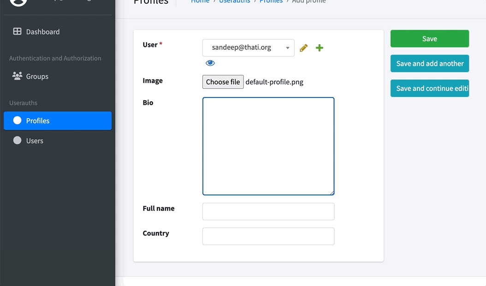

# learning-management-platform-React-Django
Online training and Certification Platform using Python, Django, Mysql, React. 

## Django setup

1) Create two folders named `backend` and `frontend`.
2) cd to folder backend 
3) Create virtual environment using the command `python3 -m venv venv`
4) Activate the virtual environment using command `source venv/bin/activate`
5) Install Django using the command `python3 -m pip install Django`
6) To check what apps are installed use command `pip freeze`
7) Create Django project `django-admin startproject backend` // "backend ." will remove aditional folder.
8) Install required packages. Create new txt file and name it requirements.txt and run `pip install -r requirements.txt`
9) Install app core using command `python3 manage.py startapp core`.
10) Install app userauths using command `python3 manage.py startapp userauths`
11) Install app api using command `python3 manage.py startapp api`
12) Create file called .gitignore and add files which you want to ignore.
13) Add custom apps to `settings.py` 
    ```Python
    # Application definition

    INSTALLED_APPS = [
        'jazzmin',
        'django.contrib.admin',
        'django.contrib.auth',
        'django.contrib.contenttypes',
        'django.contrib.sessions',
        'django.contrib.messages',
        'django.contrib.staticfiles',
        
        # Third party apps
        'core',
        'userauths',
        'api',
    ]

    ```Python
14) Run the server using command `python3 manage.py runserver`
15) Apply all migrations using command `python3 manage.py migrate`
16) Create superuser for admin using command `python3 manage.py createsuperuser`
17) Install jazzmin which will enhance features of admin panal.
    


## Customize Jazzmin UI
18) Add below code in settings.py

    refere to below doc for further customization.
    `[Jazzmin documentation](https://django-jazzmin.readthedocs.io/configuration/)`
    ```Python
    JAZZMIN_SETTINGS = {
    # title of the window (Will default to current_admin_site.site_title if absent or None)
    "site_title": "Sandeep Learning Admin",
    "site_header": "Sandeep Learning Admin",
    "site_brand": "Sandeep Learning Admin",
    "welcome_sign": "Welcome to the Sandeep Learning Admin",
    "copyright": "Sloka IT Services Ltd",
    "show_ui_builder": True,

    }
    ```
## Static files
19) Go to `settings.py` and write below code.
    ```Python
    from pathlib import Path
    import os

    TEMPLATES = [
        {
            'BACKEND': 'django.template.backends.django.DjangoTemplates',
            'DIRS': [os.path.join(BASE_DIR, "templates")],
            'APP_DIRS': True,
            'OPTIONS': {
                'context_processors': [
                    'django.template.context_processors.debug',
                    'django.template.context_processors.request',
                    'django.contrib.auth.context_processors.auth',
                    'django.contrib.messages.context_processors.messages',
                ],
            },
        },
    ]


    STATIC_URL = 'static/'
    STATICFILES_DIRS = [
        os.path.join(BASE_DIR, "static"),
    ]
    STATIC_ROOT = os.path.join(BASE_DIR, 'templates')
    media_url = '/media/'
    MEDIA_ROOT = os.path.join(BASE_DIR, 'media')

    ```

## Import URLs
20) Go to `urls.py` and add below code

    ```Python
    from django.conf import settings
    from django.conf.urls.static import static
    ```
21) Also in urls.py add url path to static files
    ```Python
    urlpatterns = [
        path('admin/', admin.site.urls),
    ]
    urlpatterns += static(settings.MEDIA_URL, document_root=settings.MEDIA_ROOT)
    urlpatterns += static(settings.STATIC_URL, document_root=settings.STATIC_ROOT)
    ```
## Creating custom users and models.
22) Go to userauths folder and open file models.py to update below code
    ```Python
    from django.db import models
    from django.contrib.auth.models import AbstractUser

    # Create your models here.

    class User(AbstractUser):
        username = models.CharField(max_length=255, unique=True)
        email = models.EmailField(max_length=255, unique=True)
        full_name = models.CharField(max_length=255, blank=True, null=True)
        otp = models.CharField(max_length=6, unique=True)

        USERNAME_FIELD = 'email'
        REQUIRED_FIELDS = ['username']

        def __str__(self):
            return self.email
        
        def save(self, *args, **kwargs):
            email_username, full_name = self.email.split('@')
            if self.full_name == "" or self.full_name == None:
                self.full_name = email_username
            if self.username == "" or self.username == None:
                self.username = email_username
            super(User, self).save(*args, **kwargs)


    class Profile(models.Model):
        user = models.OneToOneField(User, on_delete=models.CASCADE)
        image = models.FileField(upload_to='profile_pics/', default = "default-profile.png", blank=True, null=True)
        bio = models.TextField(blank=True, null=True)
        full_name = models.CharField(max_length=255, blank=True, null=True)
        country = models.CharField(max_length=255, blank=True, null=True)
        created_at = models.DateTimeField(auto_now_add=True)
        updated_at = models.DateTimeField(auto_now=True)

        def __str__(self):
            if self.full_name:
                return str(self.full_name)
            else:
                return str(self.user.full_name)

        def save(self, *args, **kwargs):
            if self.profile_pic == "":
                self.profile_pic = "profile_pics/default.png"
            if self.full_name == "" or self.full_name == None:
                self.full_name = self.user.username
            super(Profile, self).save(*args, **kwargs)


    ```
23) In userauths folder open admin.py file to update below code
    ```Python
    from django.contrib import admin
    from .models import User, Profile

    # Register your models here.

    class ProfileAdmin(admin.ModelAdmin):
        list_display = ['user', 'full_name', 'country', 'created_at', 'updated_at']
        search_fields = ['user__email', 'user__username', 'full_name', 'country']
        list_filter = ['created_at', 'updated_at']


    admin.site.register(User)
    admin.site.register(Profile, ProfileAdmin)
    ```
24) Output so far.
    

25) Automatically create Profile when User is created.
    To do that go to folder userauths and open file models.py to write below code.
    ```Python
    from django.db.models.signals import post_save

    # End of models.py write below code.

    def create_profile(sender, instance, created, **kwargs):
    if created:
        Profile.objects.create(user=instance)   

    def save_profile(sender, instance, **kwargs):
        instance.profile.save()

    post_save.connect(create_profile, sender=User)
    post_save.connect(save_profile, sender=User)
    ```

26) ## Testing.
    Create a new user and confirm profile is created automatically. Also delete user and confirm profile is deleted.
    

27) ## Serialization
    Create a new file under api folder and name it serializer.py and copy below code

    ```Python
    from rest_framework import serializers
    from userauths.models import User, Profile

    class UserSerializer(serializers.ModelSerializer):
        class Meta:
            model = User
            fields = '__all__'

    class ProfileSerializer(serializers.ModelSerializer):
        class Meta:
            model = Profile
            fields = '__all__'

    ```

28) 


